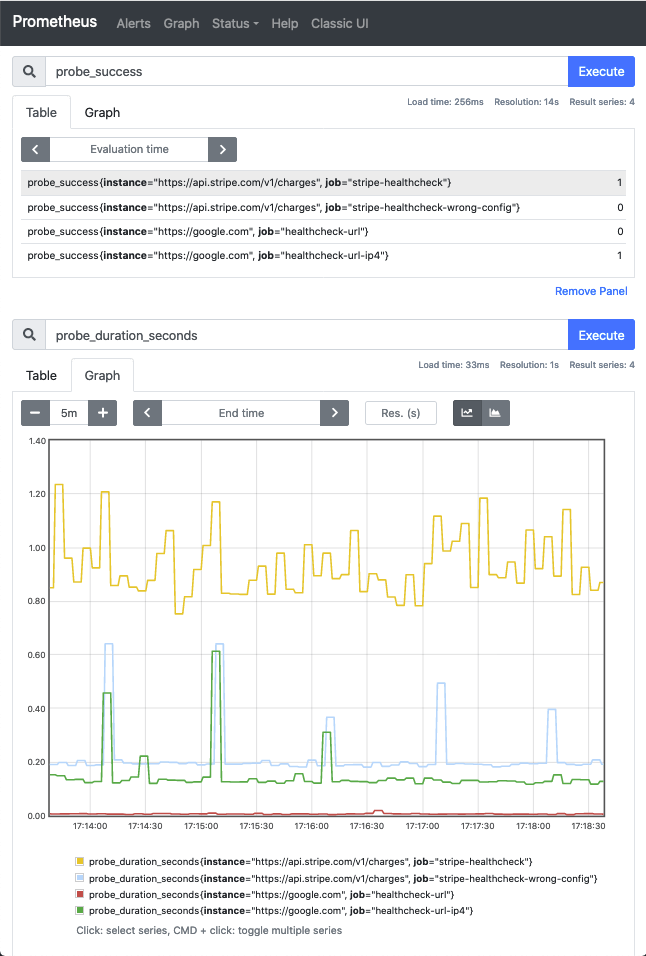

# Blackbox exporter demo

A simple demo for [blackbox exporter](https://github.com/prometheus/blackbox_exporter).

## Usage


1. Run with docker compose:

   ```bash
   docker-compose up
   ```

2. Use browser to open `http://localhost:9090/`

Now you can see something like this:

